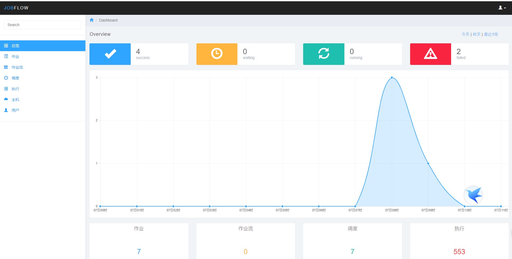

# 介绍

JOBFLOW 是用Java语言实现的一套高可用的分布式任务调度系统，主要解决周期性任务的调度管理，依赖管理问题。有友好的图形界面，便捷的任务依赖管理，健全的任务监控机制和快捷的数据修复功能。

# 解决问题

1. 分布式任务调度。
2. 友好的图形界面。
3. 便捷的任务依赖管理。
4. 服务器快速切换。
5. 任务监控。
6. 一键修复数据。

#部署需求：
软件需求：jdk1.8+，tomcat，mysql，supervisor, zookeeper
  （1）用maven编译生成master.jar，worker.jar及后台程序jobflow.war
  （2）jobflow.war部署至tomcat。
  （3）用supervisor管理master，worker守护进程。
  （4）编译生成的master_v2是高可用版本，需要zookeeper集群，可以根据需要选择。

#用户界面

